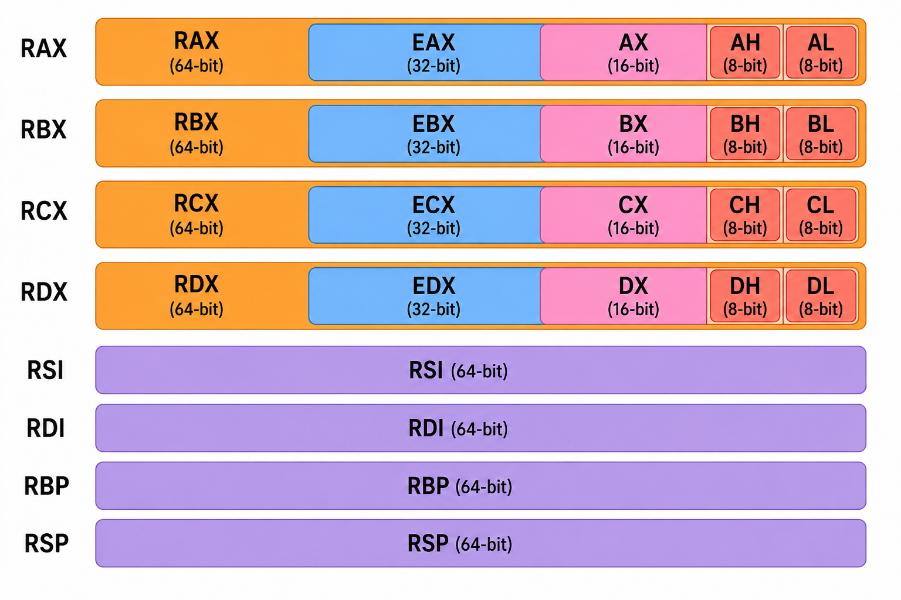

## Registers
A register is a small, high-speed storage location located inside the CPU, used to hold data, memory addresses, or instructions that are currently being processed or immediately needed by the CPU. A CPU  is the part of a computer that executes instructions, and inside the CPU there are small, extremely fast storage locations called registers.

## History of Registers

The original Intel 8008 CPU from 1972 had four main general-purpose registers called A, B, C, and D, and because it was an 8-bit CPU, these registers were 8 bits wide. Each register originally had a somewhat specific job. A was mainly an accumulator for arithmetic, B could be used for addressing memory, C was commonly used as a counter, and D was used for additional data. Then Intel created the 8086 in 1978, which was a 16-bit CPU. Instead of throwing away the old 8-bit registers, Intel expanded them to 16 bits. So the old A register became AX, B became BX, C became CX, and D became DX. The clever part is that AX could still be divided into smaller pieces: the lower 8 bits were called AL, and the upper 8 bits were called AH. So you can imagine AX like this: AH | AL, where AH is 8 bits and AL is 8 bits, making AX 16 bits total.

Then in 1985, Intel released the 80386, which moved the architecture to 32 bits. Again, instead of destroying the existing registers, they simply expanded them. AX became EAX, BX became EBX, CX became ECX, and DX became EDX. The E basically means extended. So now EAX was 32 bits, but you could still access its lower 16 bits using AX, and inside AX you could still access AL and AH. In other words, these aren't completely separate registers—they are different ways of accessing portions of the same physical register.

Then we eventually got 64-bit processors. AMD introduced the first x86-64 processors in 2003, and Intel followed. The 32-bit registers were expanded again. So EAX became RAX, EBX became RBX, ECX became RCX, and EDX became RDX. The R refers to the 64-bit register. So now you can think of RAX like this: RAX = 64 bits, inside it is EAX = lower 32 bits, inside that is AX = lower 16 bits, and inside AX are AH and AL, each 8 bits.

A really important thing to understand is that RAX, EAX, AX, AH, and AL are not five completely different storage locations. They're different views of the same register. Imagine you have a 64-bit box. If you look at the whole box, that's RAX. If you look only at the bottom 32 bits, that's EAX. If you look at the bottom 16 bits, that's AX. If you look at the bottom 8 bits, that's AL. And if you look at the 8 bits immediately above AL, that's AH. The same idea applies to RBX/EBX/BX/BH/BL, RCX/ECX/CX/CH/CL, and RDX/EDX/DX/DH/DL.



## Types of Registers

## General Purpose Register
A general-purpose register is a CPU register used for temporary storage of data, addresses, or intermediate results during program execution.

```
                                | 64-bit | 32-bit | 16-bit | 8-bit |
                                | ------ | ------ | ------ | ----- |
                                | RAX    | EAX    | AX     | AL    |
                                | RBX    | EBX    | BX     | BL    |
                                | RCX    | ECX    | CX     | CL    |
                                | RDX    | EDX    | DX     | DL    |
```

## Accumulator
An accumulator is a special-purpose register in the CPU used to store the results of arithmetic or logic operations.

```
                        | 64-bit  | 32-bit  | 16-bit | 8-bit (lower) | 8-bit (higher) |
                        | ------- | ------- | ------ | ------------- | -------------- |
                        |  RAX    |  EAX    |   AX   |     AL        |     AH         |
```

## Instruction Register (IR)
The instruction register is a CPU register that holds the currently executing instruction fetched from memory.

## Program Counter (PC)
The program counter (PC), called RIP in x64 or EIP in x86, is a CPU register that holds the address of the next instruction to execute.
```
| CPU Architecture | Register Name | Purpose / Use                                                          | Notes                                                                             |
| ---------------- | ------------- | ---------------------------------------------------------------------- | --------------------------------------------------------------------------------- |
| x86              | EIP           | Holds the **address of the next instruction** to execute               | 32-bit system; automatically increments unless a jump/branch occurs               |
| x64              | RIP           | Holds the **address of the next instruction** to execute               | 64-bit system; used in Windows x64 calling convention; controls instruction fetch |
| All CPUs         | PC            | Works with Instruction Register (IR) to fetch and execute instructions | Updated every CPU cycle; not directly writable in normal programs                 |
```

## Stack Pointer
RSP (x64) / ESP (x86) is a CPU register that points to the top of the stack. Stack grows downwards in memory (toward smaller addresses).RSP always points to the most recent value pushed onto the stack.

## Base Pointer
RBP (x64) / EBP (x86) is a CPU register that points to the start (base) of the current function’s stack frame.

```
| Register  | Role          | Moves?                        | Use                                          |
| --------- | ------------- | ----------------------------- | -------------------------------------------- |
| RSP / ESP | Stack Pointer | Moves as stack grows/shrinks  | Top of stack for PUSH/POP/allocations        |
| RBP / EBP | Base Pointer  | Usually fixed within function | Stable reference for local vars & parameters |
```

## Cheatsheet

| Description                       | 64-bit Register | 32-bit Register | 16-bit Register | 8-bit Register |
| --------------------------------- | --------------- | --------------- | --------------- | -------------- |
| **Data/Arguments Registers**      |                 |                 |                 |                |
| Syscall Number / Return Value     | `rax`           | `eax`           | `ax`            | `al`           |
| Callee Saved                      | `rbx`           | `ebx`           | `bx`            | `bl`           |
| 1st Arg – Destination Operand     | `rdi`           | `edi`           | `di`            | `dil`          |
| 2nd Arg – Source Operand          | `rsi`           | `esi`           | `si`            | `sil`          |
| 3rd Arg                           | `rdx`           | `edx`           | `dx`            | `dl`           |
| 4th Arg – Loop Counter            | `rcx`           | `ecx`           | `cx`            | `cl`           |
| 5th Arg                           | `r8`            | `r8d`           | `r8w`           | `r8b`          |
| 6th Arg                           | `r9`            | `r9d`           | `r9w`           | `r9b`          |
| **Pointer Registers**             |                 |                 |                 |                |
| Base Stack Pointer                | `rbp`           | `ebp`           | `bp`            | `bpl`          |
| Current / Top Stack Pointer       | `rsp`           | `esp`           | `sp`            | `spl`          |
| Instruction Pointer *(call only)* | `rip`           | `eip`           | `ip`            | `ipl`          |
