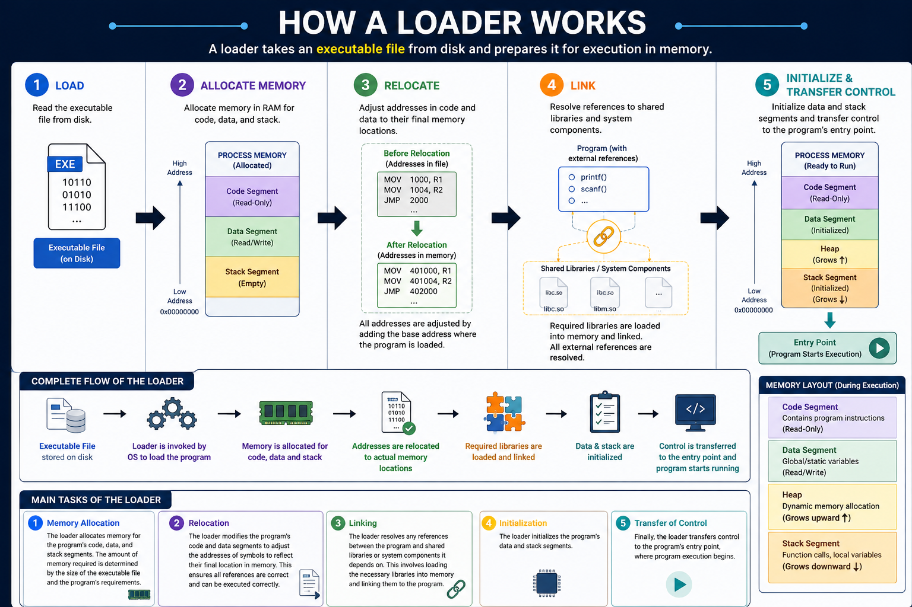

## Machine Code
Machine code is the lowest-level programming language consisting of binary digits (0s and 1s) that a computer's central processing unit (CPU) can execute directly without any translation. . 

Why do we usually see hexadecimal?

Technically, machine code is just binary data:

```
10111000 00000101 00000000 00000000 00000000
```

It's much easier for humans to read it as hexadecimal:
```
B8 05 00 00 00
```

So:
```
Binary        → 10111000 00000101 ...
Hexadecimal   → B8 05 00 00 ...
Assembly      → mov eax, 5
```
All three represent the same underlying instruction, jus at different levels


## Shellcode
Shellcode is a sequence of machine-code instructions, usually represented as raw bytes, designed to be executed directly by a processor to perform a specific task traditionally starting or interacting with a command shell. We know that each executable binary is made of machine instructions written in Assembly and then assembled into machine code. A shellcode is the hex representation of a binary's executable machine code. 

## Loader
A loader is a program that loads an executable file into memory and prepares it for execution. The loader is typically part of the operating system and is responsible for allocating memory for the program, resolving references between the program and any shared libraries or system components it depends on, and initializing the program's data and stack segments.

The main tasks of the loader are:

i. **Memory allocation:** The loader allocates memory for the program's code, data, and stack segments. The amount of memory required is determined by the size of the executable file and the program's requirements.

ii. **Relocation:** The loader modifies the program's code and data segments to adjust the addresses of symbols to reflect their final location in memory. This ensures that all the references to symbols are correct and can be executed correctly.

iii. **Linking:** The loader resolves any references between the program and shared libraries or system components it depends on. This involves loading the necessary libraries into memory and linking them to the program.  It automatically finds and loads extra files the program needs, such as system Dynamic-Link Libraries (DLLs) like kernel32.dll

iv. **Initialization:** The loader initializes the program's data and stack segments and transfers control to the program's entry point. It sets up the process environment, variables, and thread structures so the processor (CPU) can execute the instructions



Dropper:
A dropper is a type of malware whose primary purpose is to deliver and install another malicious payload onto a victim’s system. The payload is typically embedded or packaged within the dropper itself. When executed, the dropper extracts or writes the payload to the system and may then execute it.

Loader:
A loader is a type of malware whose primary purpose is to load or retrieve another malicious payload and prepare it for execution. Unlike a dropper, the payload is often stored separately, such as on a remote server, and the loader may download, decrypt, or load the payload into memory before execution.

| Feature                      | Dropper                                                                                 | Loader                                                                                   |
| ---------------------------- | --------------------------------------------------------------------------------------- | ---------------------------------------------------------------------------------------- |
| **Payload Location**         | Embedded or packaged inside the malware                                                 | Usually hosted separately, often on a remote server                                      |
| **Internet Required?**       | Usually **no** for the initial payload delivery                                         | Often **yes**, if it needs to retrieve the payload                                       |
| **File Size**                | Generally larger because it may carry the payload                                       | Generally smaller because it may primarily contain retrieval/loading logic               |
| **Payload Flexibility**      | Relatively static; changing the embedded payload usually requires modifying the dropper | More flexible; the remote payload can potentially be changed without changing the loader |
| **Main Purpose**             | Deliver and/or install a payload                                                        | Retrieve, load, decrypt, and/or execute a payload                                        |
| **Detection Considerations** | Payload is present in the file, giving security tools something to analyze directly     | Payload may not be present initially, potentially making static analysis more difficult  |


## Offset
A memory offset is a number that shows the distance in bytes from a starting point, known as a base address, to a specific target location in memory. Adding the offset to the base address gives the exact physical or virtual memory address.

In **memory**, an **offset** is simply:

```
The distance, measured in bytes, from a reference address to another address.**
```

### Example

Suppose a DLL is loaded at:

```text
Module Base = 0x10000000
```

A function is located at:

```text
Address = 0x10002500
```

The offset is:

```text
0x10002500
-0x10000000
------------
     0x2500
```

So:

```text
Base Address + Offset = Address
0x10000000  + 0x2500 = 0x10002500
```

RVA tells you how far something is from the module's base. The VA is the actual virtual memory address of something after the PE has been loaded.


## Reflective Programming (Reflection)

Reflective programming, or reflection, is a programming feature that allows a running program to examine, inspect, and sometimes modify its own structure, metadata, and behavior at runtime. Instead of needing to know everything about an object, class, method, or type when the program is compiled, reflection allows the program to discover and work with that information while it is running.

For example, a program can use reflection to find out what type an object is, what properties or fields it contains, what methods are available, and what information is associated with those methods or types. In languages that provide powerful reflection APIs, the program can also dynamically call methods, create objects, read or change properties, or load components whose details were not known when the program was originally written.

Key Concepts
- Introspection: The ability of a program to examine information about itself or its components at runtime, such as available classes, methods, fields, properties, and types.
- Dynamic Invocation: The ability to call a method or create an object dynamically using information discovered at runtime rather than directly referencing it in the source code.
- Dynamic Access and Modification: In languages that support it, reflection can allow a program to read or modify properties, fields, or other aspects of an object while it is running.
- Runtime Metadata: Reflection commonly works with metadata that describes program components, allowing the program to learn about types and their members without having all of that information explicitly hard-coded.
