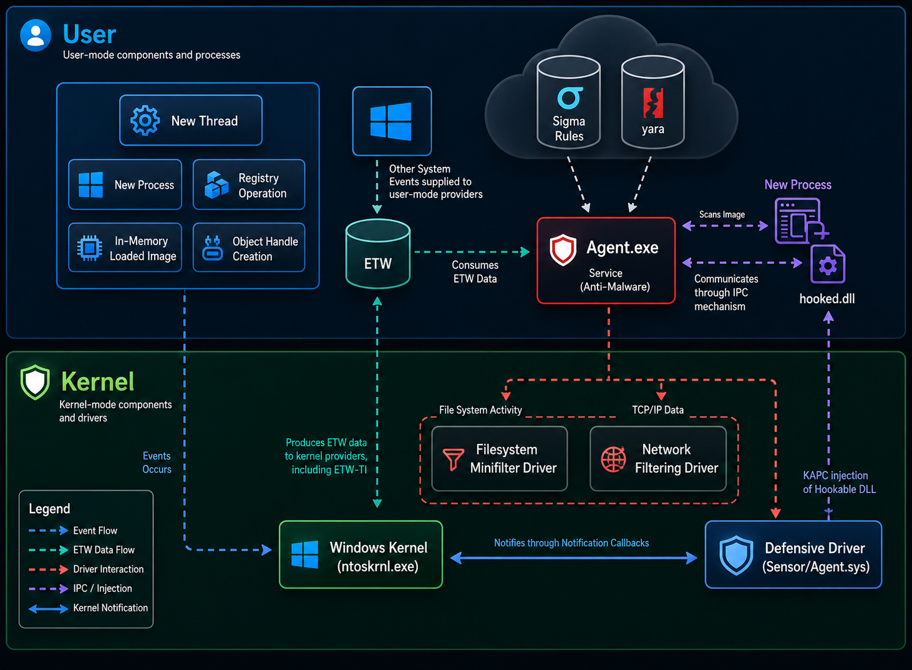

## Endpoint Detection and Response
<p align="justify"> EDR is a security technology deployed on endpoints such as workstations, servers, and laptops that continuously monitors endpoint activity, detects suspicious or malicious behavior, records telemetry, and enables security teams to investigate and respond to threats. While the term "endpoint" typically refers to devices like workstations and laptops, many leading EDR products also extend their support to Linux systems. Furthermore, some EDR products are evolving into Extended Detection and Response XDR platforms by correlating telemetry from endpoints, networks, and cloud environments </p>
 
## Components of an EDR

### 1. Sensors

Sensors are the components that observe activity on the endpoint and turn it into telemetry. The source describes them as components that intercept data, extract information, and forward it to the agent. Examples mentioned include native event logs, drivers, function-hooking DLLs, and minifilters.

### 2. Telemetry
Telemetry is the security-relevant data generated by the Windows operating system that records system, process, user, file, registry, network, and other endpoint activities. EDR solutions collect and analyze this data to provide visibility, detect suspicious behavior, investigate incidents, and support response actions.

### 2. Agent 
The EDR agent is an application that runs on a device to continuously monitor security-relevant activity, collect and process telemetry, that controls and consumes data from sensor components, performs some basic analysis to determine whether a given activity or series of events aligns with attacker behavior, and forwards the telemetry to the main server (EDR Dashboard), which further analyzes events from all agents deployed in an environment. An EDR (Endpoint Detection and Response) agent runs as a background service on Windows.

```
sc query type= driver | more
```

### Components Inside an Agent 
- Kernel Driver / Sensor: Operates at the lowest operating system level to intercept system calls, register callbacks, and monitor low-level operations like process creation, driver loading, and registry modifications.

- User-Mode Service / Daemon: Manages the main logic of the agent, processes data collected from drivers or hooks, handles configuration updates, and maintains persistent communication with the central management server.
  
- Hooking DLLs:  A DLL that is responsible for intercepting calls to specific application programming interface (API) functions.

- File System Mini filter Driver

### 3. Detection Engine

The detection Engine takes telemetry and attempts to determine whether activity is benign or malicious. The source mentions approaches such as environmental heuristics and static signature libraries.  

### 4. Backend Storage
Centralized infrastructure for storing, processing, and performing heavier analysis on the telemetry data collected from agents.

### 5. Management Console
A user interface that provides visibility into endpoint activities, allows security analysts to configure EDR policies, initiate response actions, and conduct investigations.


## EDR Architecture

``` python
                    ┌───────────────────────────────┐
                    │        EDR BACKEND            │
                    │                               │
                    │  • Collects telemetry         │
                    │    from all agents            │
                    │  • Backend detection logic    │
                    │  • Correlation / analysis     │
                    └───────────────▲───────────────┘
                                    │
                              Telemetry
                                    │
                    ┌───────────────┴───────────────┐
                    │          EDR AGENT            │
                    │                               │
                    │  • Controls sensors           │
                    │  • Consumes telemetry         │
                    │  • Basic analysis             │
                    │  • Forwards telemetry         │
                    │  • May perform prevention     │
                    └───────────────▲───────────────┘
                                    │
                              Sensor data
                                    │
              ┌─────────────────────┴─────────────────────┐
              │                  SENSORS                  │
              │                                           │
              │  OS Event Logs     Kernel Driver          │
              │  ETW               Function Hooks         │
              │  DLLs              Minifilters            │
              │                                           │
              └─────────────────────┬─────────────────────┘
                                    │
                              Raw Telemetry
                                    │
                                    ▼
                    ┌───────────────────────────────┐
                    │       DETECTION LOGIC         │
                    │                               │
                    │  • Rules / signatures         │
                    │  • Heuristics                  │
                    │  • Correlation                 │
                    │  • Behavioral conditions       │
                    └───────────────┬───────────────┘
                                    │
                         Malicious / suspicious
                                    │
                                    ▼
                    ┌───────────────────────────────┐
                    │        RESPONSE                │
                    │                               │
                    │  • Alert                      │
                    │  • Block operation             │
                    │  • Deceive / disrupt attacker │
                    │  • SIEM / EDR dashboard       │
                    └───────────────────────────────┘
```


## EDR Architecture


Modern EDR solutions employ a multi-layered architecture that combines user-mode and kernel-mode components to achieve comprehensive visibility and protection. The architecture typically consists of a kernel driver for low-level monitoring, user-mode services for analysis, and cloud components for intelligence sharing and updates.

## Types of Bypasses
* Configuration bypass: The sensor *can* collect the relevant telemetry, but it isn't configured to collect it.

* Perceptual bypass: The sensor *cannot collect* the relevant telemetry because it lacks the capability.

* Logical bypass: The telemetry is collected, but the detection logic has a gap that fails to detect the activity.

* Classification bypass: The telemetry is collected and evaluated, but there isn't enough evidence to classify the activity as malicious.

## EDR enumeration

```
# Process-level EDR detection — running processes
tasklist /v | findstr -i "csagent CrowdStrike SentinelAgent S1Service \
   MsSense MsSenseS MDE CarbonBlack cb.exe XDR cortex elastic-agent \
   AmpAgent CylanceSvc winlogbeat sysmon"

# Service-level — installed services often present even when AV disables/sleeps
sc query | findstr -i "CSFalconService SentinelAgent WinDefend Sense MsSense \
   CarbonBlackCloud cyserver xagt"

# Kernel-level — drivers signal what's hooking the kernel
driverquery /v | findstr -i "csagent CrowdStrike S1 SentinelMonitor \
   MpKsl WdFilter WdNisDrv csaagent CbDefense CbStream"

# PowerShell — load-time check that's quiet
Get-Service | ?{$_.Status -eq 'Running'} | ?{$_.Name -match 'CrowdStrike|Sentinel|Carbon|Defender|McAfee|Symantec|Cylance|Cortex|MsSense'}

# Memory-resident DLLs (some EDRs hide as processes but inject everywhere)
[System.Diagnostics.Process]::GetCurrentProcess().Modules | ?{$_.ModuleName -match 'csagent|sentinel|cb|xagt'}

# Network-level — outbound EDR phone-home
nslookup ts01-b.cloudsink.net          # CrowdStrike sensor LB
nslookup *.sentinelone.net             # SentinelOne
nslookup *.defender.microsoft.com      # Defender for Endpoint
nslookup *.cylance.com                 # Cylance

# Defender-specific
Get-MpComputerStatus | Select RealTimeProtectionEnabled, AntivirusEnabled, TamperProtectionEnabled, IsTamperProtected
Get-MpPreference | Select ExclusionPath, ExclusionExtension, ExclusionProcess
```
